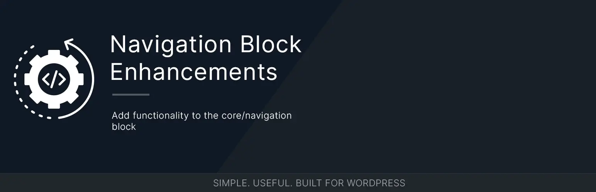

# Navigation Block Enhancements



[](https://wordpress.org/)
[](https://www.php.net/)
[](https://github.com/bob-moore/navigation-block-enhancements/releases/latest)
[](https://www.gnu.org/licenses/gpl-2.0.html)

[](https://github.com/bob-moore/navigation-block-enhancements/actions/workflows/lint-assets.yml)
[](https://github.com/bob-moore/navigation-block-enhancements/actions/workflows/phpcs.yml)
[](https://github.com/bob-moore/navigation-block-enhancements/actions/workflows/phpstan.yml)

Enhance the WordPress Navigation block (`core/navigation`) with better vertical submenu behavior and hover/focus color controls.

## Features

### Vertical Submenus

- Improves click-open submenu behavior for vertical Navigation blocks.
- Removes Navigation block focusout handlers from vertical menu output so submenus do not collapse unexpectedly while users move through the menu.
- Styles vertical click-open submenus as in-flow accordion-style lists instead of detached flyout menus.
- Replaces the core sibling submenu icon with a clickable button pseudo-element, using `src/images/chevron-down.svg` as a CSS mask.
- Supports left, center, right, and stretch justification modes for vertical navigation layouts.

### Overlay Debugging

- Adds an opt-in development mode for inspecting responsive Navigation overlays.
- When enabled, removes the overlay container's focusout handler so the overlay stays open while browser developer tools have focus.
- Skips this processing when the Navigation block's overlay menu setting is `never`.
- Enable with the `navigation_block_enhancements_enable_dev_mode` filter:

```php
add_filter( 'navigation_block_enhancements_enable_dev_mode', '__return_true' );
```

### Hover/Focus Colors

- Adds text and background color controls for Navigation item hover/focus states to the `core/navigation` block inspector's Color panel.
- Adds **Text - Hover** and **Background - Hover** controls with alpha support.
- Controls are clearable and integrate with "Reset All".
- Previews selected hover/focus colors in the editor.
- Applies colors on the frontend for `:hover`, `:focus`, and `:focus-visible` states.
- Outputs CSS custom properties (`--core-nav-focus-color`, `--core-nav-focus-background-color`) on the Navigation wrapper so themes can override or extend behavior.

### Architecture

- Boots through a single `Controller` that builds a small PHP-DI container and mounts all WordPress hooks.
- Splits responsibilities into focused services, providers, and processors:
    - `AssetLoader` registers editor assets and block-scoped styles for `core/navigation`.
    - `DropDown` processes vertical Navigation block markup with `WP_HTML_Tag_Processor`.
    - `Modal` optionally removes responsive overlay focusout behavior for development/debugging.
    - `Colors` adds frontend classes and CSS custom properties for hover/focus colors.
    - `FilePathResolver` and `UrlResolver` keep package paths configurable for plugin and Composer usage.
- Scopes bundled runtime dependencies in release zips to avoid conflicts with other plugins.
- Ships release zips with optional compiled container cache support.
- Ships plugin banner and icon assets for release/update metadata.
- Surfaces GitHub release updates in WordPress admin through the bundled updater.
- Can be embedded in other plugins or themes via Composer.

## Requirements

- WordPress 6.9+
- PHP 8.2+

## Installation

### Install as a plugin

1. Download the latest release zip from GitHub releases.
2. In WordPress admin, go to Plugins -> Add New Plugin -> Upload Plugin.
3. Upload the zip and activate Navigation Block Enhancements.

### Install from source

If you are building this repository directly:

```bash
npm run build
npm run plugin-zip
```

Then upload the generated release zip in WordPress admin.

### Install via Composer (library usage)

If you are embedding this into your own project:

```bash
composer require bmd/navigation-block-enhancements
```

Then bootstrap:

```php
use Bmd\NavBlockEnhancements\Controller;

$dependency_url  = plugin_dir_url( __FILE__ ) . 'vendor/bmd/navigation-block-enhancements/';
$dependency_path = plugin_dir_path( __FILE__ ) . 'vendor/bmd/navigation-block-enhancements/';

$plugin = new Controller(
    $dependency_url,
    $dependency_path,
    false
);

$plugin->mount();
```

The constructor expects the public URL and filesystem path pointing to the Navigation Block Enhancements dependency root, not the file where you call it. The third argument enables PHP-DI container compilation; leave it `false` for Composer-embedded usage unless your project manages its own cache lifecycle.

## Usage

### Use Vertical Submenus

1. Add a Navigation block.
2. Set the layout orientation to vertical.
3. Configure submenus to open on click.
4. Save and view the page.

The plugin adjusts the rendered Navigation block markup and styles so vertical click-open submenus behave like in-flow menu sections.

### Set Hover/Focus Colors

1. Add or select a Navigation block.
2. Open the block sidebar.
3. Open the **Color** panel.
4. Use **Text - Hover** and **Background - Hover** to choose hover/focus colors.
5. Save and view the post or template.

## CSS Custom Properties

The following CSS custom properties are available for theming:

| Property | Default | Description |
|---|---|---|
| `--core-nav-submenu-indicator-size` | `1rem` | Width and height of the generated submenu chevron |
| `--core-nav-focus-color` | - | Navigation item text color on hover/focus (set per block) |
| `--core-nav-focus-background-color` | - | Navigation item background color on hover/focus (set per block) |

## Changelog

### 1.0.0

- Rebuilt the plugin around a focused PHP-DI controller and provider/processor services.
- Added editor controls for Navigation item hover/focus text and background colors.
- Added editor preview and frontend rendering for Navigation hover/focus colors.
- Added CSS custom properties for Navigation hover/focus colors.
- Improved vertical click-open submenu behavior for the core Navigation block.
- Added an opt-in dev-mode filter for keeping responsive Navigation overlays open while inspecting them.
- Replaced the core sibling submenu icon with a generated chevron on the clickable Navigation toggle.
- Added GitHub release update support and plugin directory-style image assets.
- Scoped release dependencies to reduce conflicts with other plugins.

## License

GPL-2.0-or-later. See the [GNU General Public License](https://www.gnu.org/licenses/gpl-2.0.html).
